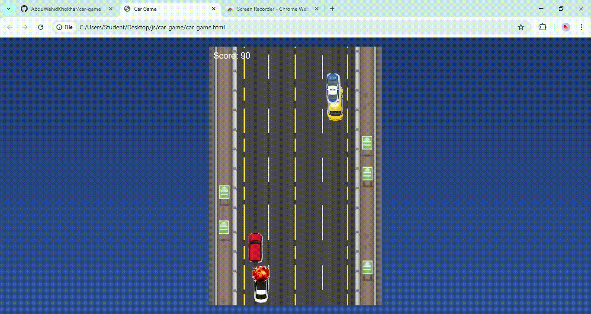

# Car Game 🚗💨

Welcome to my **Car Game** — a fast-paced, browser-based driving game built using **JavaScript**, **HTML**, and **CSS**! This project is a fun demonstration of front-end web development, animation, collision detection, and responsive design.

## 🎮 Features
- Smooth car movement with arrow keys
- Dynamic obstacle generation
- Score tracking system
- Collision detection
- Responsive design for different screen sizes
- Simple and lightweight — no external libraries

## 🛠️ Technologies Used
- **HTML** for game layout and structure
- **CSS** for styling and animations
- **JavaScript** for game logic and interactivity

## 🚀 How to Play
1. Open the game in your browser.
2. Use the **arrow keys** to control your car.
3. Avoid obstacles and keep driving to increase your score.
4. Game over when you crash!

Feel free to fork this project, customize it, or use it as a starting point for your own game ideas.

---

🧠 *Built for fun and learning — enjoy the ride!*
